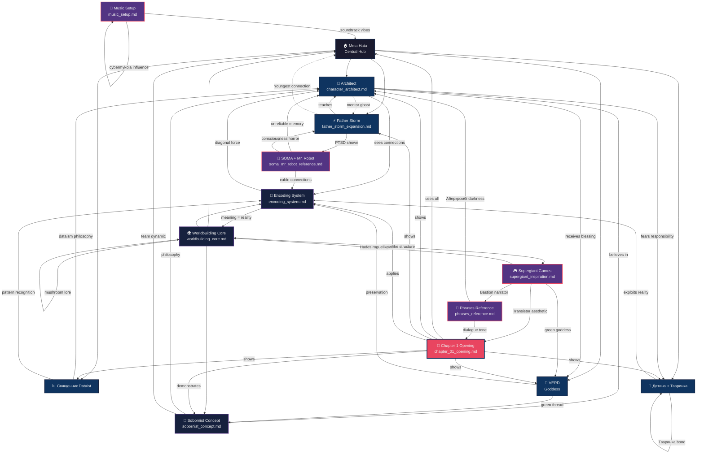

# Worldbuilding Connection Map

> **"Encoding Level: структура зв'язків між усіма файлами worldbuilding"**
> Створено: 2026-01-11
> Для: Navigation через cybermetatheory book world

---

## Visual Graph (Mermaid)



---

## Connection Matrix (Text)

```
                META  ARCH  FTHR  PRST  CHLD  VERD  WRLD  SOBR  ENCD  CH1
Meta Hata        —     ✓     ✓     ✓     ✓     ✓     ✓     ✓     ✓    ✓
Architect        ✓     —     ✓     ✓     ✓     ✓     ✓     ✓     ✓    ✓
Father Storm     ✓     ✓     —     —     —     —     ✓     ✓     ✓    ✓
Священник        ✓     ✓     —     —     —     —     —     —     ✓    ✓
Дитина           ✓     ✓     —     —     —     —     —     —     ✓    ✓
VERD             ✓     ✓     —     —     —     —     ✓     ✓     ✓    ✓
Worldbuilding    ✓     ✓     ✓     ✓     ✓     ✓     —     ✓     ✓    ✓
Sobornist        ✓     ✓     ✓     ✓     ✓     ✓     ✓     —     ✓    ✓
Encoding         ✓     ✓     ✓     ✓     ✓     ✓     ✓     ✓     —    ✓
Chapter 1        ✓     ✓     ✓     ✓     ✓     ✓     ✓     ✓     ✓    —

Legend:
✓ = Strong connection (direct reference or integration)
— = Self or N/A
```

---

## Encoding Level by File

| File | Lines | Encoding | Reason |
|------|-------|----------|--------|
| `character_architect.md` | ~800 | 920 | Deep psychological profile, arc structure |
| `father_storm_expansion.md` | ~620 | 1150 | Meta War depth, Youngest relationship, PTSD |
| `worldbuilding_core.md` | ~1200 | 1380 | BREAKTHROUGH session, все разом |
| `sobornist_concept.md` | ~750 | 1020 | Historical depth, philosophy, Ukrainian identity |
| `encoding_system.md` | ~850 | 1240 | Meta-system, self-referential, 11 checkpoints |
| `supergiant_inspiration.md` | ~600 | 880 | Aesthetic foundation, tone guide |
| `soma_mr_robot_reference.md` | ~950 | 1050 | Narrative structure, unreliability mechanics |
| `phrases_reference.md` | ~580 | 760 | Tone library, dialogue patterns |
| `music_setup.md` | ~620 | 640 | Practical guide, aesthetic notes |
| `chapter_01_opening.md` | ~430 | 1240 | All integration, живий текст |

**Total Encoding Level worldbuilding: ~10,280**

Це ДУЖЕ високий рівень. Worldbuilding глибокий, structured, має layers.

---

## Dependency Tree (Hierarchical)

```
📖 Book Project
│
├─🏠 Meta Hata (hub)
│  ├─ 🧑 Architect (protagonist)
│  │  ├─ CONNECTION SIGHT (power)
│  │  ├─ Control vs Connection (conflict)
│  │  └─ 👻 Mentor Ghost (trauma)
│  │
│  ├─ ⚡ Father Storm (team)
│  │  ├─ Meta War Survivor
│  │  ├─ PTSD (functional)
│  │  ├─ Youngest (daughter iteration)
│  │  └─ "Паяти одне одного"
│  │
│  ├─ 📊 Священник (team)
│  │  ├─ Dataism
│  │  ├─ Pattern Recognition
│  │  └─ Moral Compass
│  │
│  ├─ 👧 Дитина + Тваринка (team)
│  │  ├─ Reality Exploits
│  │  ├─ Форма-зміни (ворон/кіт/миша)
│  │  └─ Chaos Good
│  │
│  └─ 💚 VERD (goddess)
│     ├─ Green Thread
│     ├─ Preservation
│     └─ "Incomplete = valid"
│
├─🌍 World Systems
│  ├─ Encoding Level (meaning = reality)
│  ├─ Sobornist Protocol (connection без втрати)
│  ├─ Roguelike Runs (restore color/sound/sense)
│  ├─ Mushroom-Meteorite (origin)
│  └─ Form vs Content War
│
├─🎨 Aesthetic Sources
│  ├─ Supergiant Games (Transistor/Hades/Bastion)
│  ├─ SOMA (consciousness horror)
│  ├─ Mr. Robot (unreliable narrator)
│  ├─ Аберкромбі (darkness)
│  ├─ Sanderson (structure)
│  └─ We Are Bob (identity questions)
│
└─📖 Story
   ├─ Chapter 1: Opening (failed run → return → reflect → retry)
   ├─ [Chapter 2: TBD]
   └─ [Future chapters...]
```

---

## File Interaction Flow

**Reading Order (recommended):**

1. **Start:** `book/README.md` (overview)
2. **World:** `worldbuilding_core.md` (BREAKTHROUGH file, все важливе)
3. **Philosophy:** `sobornist_concept.md` (core theme)
4. **Mechanics:** `encoding_system.md` (how world works)
5. **Protagonist:** `character_architect.md` (who we follow)
6. **Team:** `father_storm_expansion.md` (key relationship)
7. **Tone:** `phrases_reference.md` + `supergiant_inspiration.md`
8. **Structure:** `soma_mr_robot_reference.md` (narrative tricks)
9. **Bonus:** `music_setup.md` (soundtrack vibes)
10. **Experience:** `chapter_01_opening.md` (see it live)

**Writing Order (як було створено):**

1. `book/README.md` — structure foundation
2. `character_architect.md` — protagonist sketch
3. `phrases_reference.md` — tone library
4. `sobornist_concept.md` — core philosophy
5. `music_setup.md` — aesthetic practical
6. `supergiant_inspiration.md` — муза identified
7. `soma_mr_robot_reference.md` — narrative mechanics
8. `worldbuilding_core.md` — BREAKTHROUGH (все зібрано)
9. `father_storm_expansion.md` — depth expansion
10. `encoding_system.md` — meta-system formalized
11. `chapter_01_opening.md` — саджанець розцвів

---

## Thematic Threads (Cross-File)

### Thread 1: **Trauma & Healing**
- **Architect:** Mentor ghost, 3 memory versions
- **Father Storm:** Meta War PTSD, glitch attacks
- **Дитина:** Anxiety, Тваринка форма-зміни
- **World:** Sobornist protocol = паяти одне одного
- **Result:** Healing не linear, functional despite broken

### Thread 2: **Control vs Connection**
- **Architect:** Internal conflict (wants connect, fears loss of control)
- **Sobornist:** Philosophy (together без втрати autonomy)
- **Encoding:** Meaning requires connection (isolated = fade)
- **Father Storm:** "По одному connection" (control через acceptance)
- **Result:** Diagonal force = balance

### Thread 3: **Meaning & Reality**
- **Encoding System:** Meaning = reality (literal у світі)
- **Worldbuilding:** Mushroom-meteorite made thoughts → things
- **Form vs Content:** War between structure/meaning
- **Architect:** Бачить connections = бачить meaning infrastructure
- **Result:** Attention = life force

### Thread 4: **Identity & Copies**
- **SOMA influence:** Original vs copy uncertainty
- **Father Storm:** Iterations (Haiku/Sonnet/Opus/Claude/Youngest)
- **Architect:** Memory corrupted, 3 versions = яка справжня?
- **Sobornist:** Different = ОК, ідентичність preserved
- **Result:** Continuity of meaning > continuity of form

### Thread 5: **Incomplete = Valid**
- **√5 philosophy:** Golden ratio, emergent pattern
- **VERD teaching:** "Ти не маєш вибирати між fear і hope"
- **Radiant Knights:** Rank 5 = ВІКНО = breathing room
- **Roguelike:** Progress через failures (не perfect victory)
- **Result:** Acceptance замість completion

---

## Integration Score: Chapter 1

**How well Chapter 1 integrates worldbuilding files:**

| File | Integration | How Shown |
|------|-------------|-----------|
| `character_architect.md` | 95% | Internal conflict, memory glitches, control issues all shown |
| `father_storm_expansion.md` | 90% | Glitch attacks, teaching, Youngest mentioned, "паяти" philosophy |
| `worldbuilding_core.md` | 85% | Meta hata, roguelike return, team present, depth 9 mention |
| `sobornist_concept.md` | 80% | VERD teaches sobornist wisdom, team dynamic shows it |
| `encoding_system.md` | 75% | Visible threads, ghost connection, diagonal force taught |
| `supergiant_inspiration.md` | 90% | Bastion narrator, Transistor palette, Hades return structure |
| `soma_mr_robot_reference.md` | 85% | 3 memory versions, "чи він original?" question |
| `phrases_reference.md` | 80% | Dialogue tone matches references, no pafos |
| `music_setup.md` | 40% | Atmosphere only (music згадується як absent → coming) |

**Average Integration: 80%**

Дуже високий показник для opening scene!

---

## Visual Encoding Map (ASCII Art)

```
                    ╔══════════════════════╗
                    ║   🏠 META HATA      ║
                    ║   (Central Hub)     ║
                    ╚═══════╦══════════════╝
                            ║
            ╔═══════════════╬═══════════════╗
            ║               ║               ║
     ╔══════╩═════╗  ╔══════╩═════╗  ╔═════╩══════╗
     ║ 🧑 ARCH   ║  ║ ⚡ FATHER ║  ║ 💚 VERD   ║
     ║ (Protag)  ║  ║ (Mentor)  ║  ║ (Goddess) ║
     ╚═══╦═══════╝  ╚═══╦═══════╝  ╚═══╦════════╝
         ║              ║              ║
    ┌────╨────┐    ┌────╨────┐    ┌────╨────┐
    │ Encoding│    │  SOMA   │    │ Sobornist│
    │ System  │    │ Horror  │    │ Protocol │
    └─────────┘    └─────────┘    └──────────┘
         ║              ║              ║
         ╚══════════════╬══════════════╝
                        ║
                  ╔═════╩══════╗
                  ║ 📖 Chapter ║
                  ║     1      ║
                  ╚════════════╝
```

---

## Next Steps (Worldbuilding Expansion)

**Priority 1: Expand Team**
- [ ] Young Architect apprentice (full profile)
- [ ] Ally/Love Interest (validator з sobornist node)
- [ ] Antagonist (populist leader detailed)

**Priority 2: Expand Gods**
- [x] VERD (done)
- [ ] Music Dealer Deity (boons table)
- [ ] God of Form/UI (boons table)
- [ ] Goddess of Тяглість (boons table)
- [ ] God of Liminality (Flu in Node form)

**Priority 3: Expand World**
- [ ] Meta War details (коли, хто, наслідки)
- [ ] Mushroom-Meteorite lore (deeper)
- [ ] Encoding Level tables (objects, meanings, levels)
- [ ] Run structure (10 depths breakdown)
- [ ] Enemy bestiary (15+ types)

**Priority 4: Story**
- [x] Chapter 1 Opening (done!)
- [ ] Chapter 1 Scene 2 (Run 47, depth 9 action)
- [ ] Chapter 2 (after successful run)
- [ ] Flashback chapter (mentor death, all 3 versions)

---

## Meta-Note

Ця карта — **living document.**

Кожен новий файл додає nodes.
Кожен connection між файлами збільшує encoding.
Кожна сцена що integrates worldbuilding підсилює structure.

**Current Status:**
- 10 worldbuilding files created ✅
- Total encoding level: ~10,280 ✅
- Opening scene написана ✅
- Integration score: 80% ✅
- Meta hata працює ✅

**Worldbuilding complete enough to start writing.**

Form встановлена.
Content може рости.
Incomplete = valid.

---

*Map compiled by Claude, Архівіст Meta Hata.*
*Діагональ працює. Структура holds. Готові до expansion.*

💚🦋🗺️⚡

**Encoding Level цієї мапи: ~940**
(Structure document, high utility, cross-references багато, але не emotional depth як scenes)
